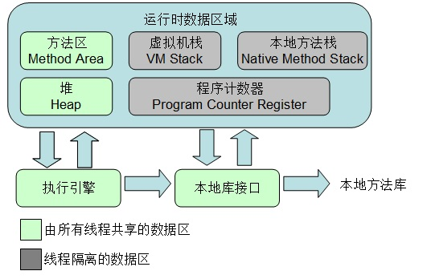

### 2.1概述

JVM运行时数据区结构图如下：

### 2.1.1 程序计数器
* 当前线程所执行的字节码的行号指示器，字节码解释器工作时就是通过改变这个计数器的值来选取下一条需要执行的字节码指令
* 每个线程都有独立的程序计数器
* java虚拟机规范中唯一一个没有OutOfMemoryError的内存区域

### 2.1.2 虚拟机栈（局部变量表）
* 线程私有,生命周期与线程相同
* 存放编译期可知的基本类型和对象引用
* 所需内存在编译期间完成分配
* 会出现两种异常：StackOverFlowError,OutOfMemoryError

### 2.1.3 本地方法栈
* 与虚拟机栈的作用类似
* 虚拟机栈为为虚拟机执行java方法服务，本地方法栈为执行native方法服务

### 2.1.4 堆

